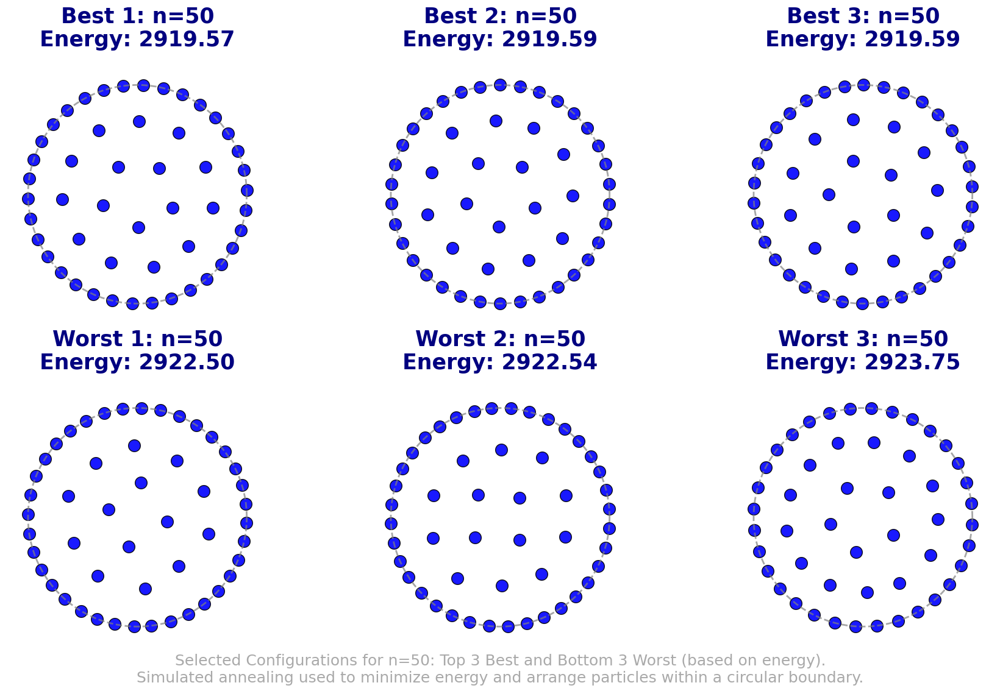

# Stochastic_Simulation_Assignment_3
## Finding The Minimal Energy Configuration Of Charge Particle Within A Circle
The project uses simulated annealing to find the minimal energy configurations of charged particles within a circular boundary. It tests various cooling schedules and neighboring strategies, achieving optimal configurations for systems up to 50 particles while improving on prior results.

## Authors:
- Maarten Stork
- Paul Jungnickel
- Lucas Keijzer

## Files:
- `MaartenStork_15761770_PaulJungnick…5716554_LucasKeijzer_14041073.ipynb` - Notebook containing the results
- `/model` - Contains the code for running a single simulated annealing process
- `/plots` - Contains all the plots generated 
- `/data` - Contains the data from previous runs 

## Dependencies:
- **os**: Used for handling file paths and directory operations.
- **random**: For generating random numbers and seeds.
- **numpy** (`np`): Used for numerical operations, creating grids, and random number generation.
- **pandas** (`pd`): For data manipulation and analysis.
- **matplotlib** (`plt`): Used for plotting graphs and visualizations.
- **scipy.stats**: Used for statistical analysis, such as t-tests.
